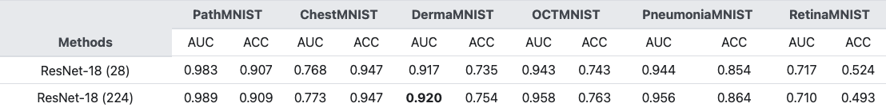

# Lesion Classification

This project uses deep learning methods to classify lesions in retinal images. It primarily employs a ResNet18 network architecture based on CORAL (ContinuAble Ordinal Regression).

## Method

### Network Architecture
- **Base Network**: ResNet18 (with ImageNet pretrained weights)
- **Enhancement Method**: CORAL (ContinuAble Ordinal Regression for Deep Ordinal Classification)
- **Input Size**: 224×224 RGB images
- **Output**: K-1 neurons for K ordered categories

### CORAL Method Introduction
CORAL is an approach for handling ordinal classification problems by transforming a multi-class ordinal classification problem into multiple binary classification problems:
- For K categories, output K-1 logits
- Each logit represents the probability that a sample belongs to "category > i"
- Utilizes ordinal characteristics by sharing network parameters across binary classification tasks

### Dataset
- **RetinaMNIST**: Data from MedMNIST containing retinal images
- Contains lesion images with multiple ordered severity levels

### Training Details
- **Optimizer**: Adam
- **Learning Rate**: 1e-5 (adjusted for improved stability)
- **Batch Size**: 32
- **Regularization**: Uses weight decay (1e-4) to prevent overfitting

## Results

in other:

This method:

- **Accuracy**: ~56%
- **Loss Function**: Binary Cross Entropy (suitable for CORAL method)

## File Descriptions
- `train.py`: Training script including data loading, model training, and validation process
- `models/resnet18_coral.py`: Defines the ResNet18-CORAL model architecture
- `utils/coral.py`: Contains CORAL-related label transformation and loss function implementation
- `test.py`: Testing script
- `plot_loss.py`: Loss visualization script

## Improvement Directions
1. Adjust hyperparameters (learning rate, batch size, etc.)
2. Try different data augmentation strategies
3. Use more complex model architectures
4. Implement more advanced regularization techniques